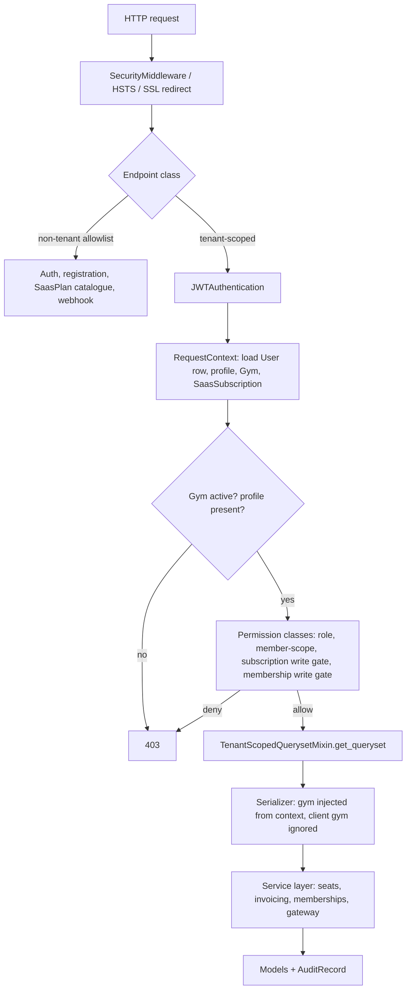
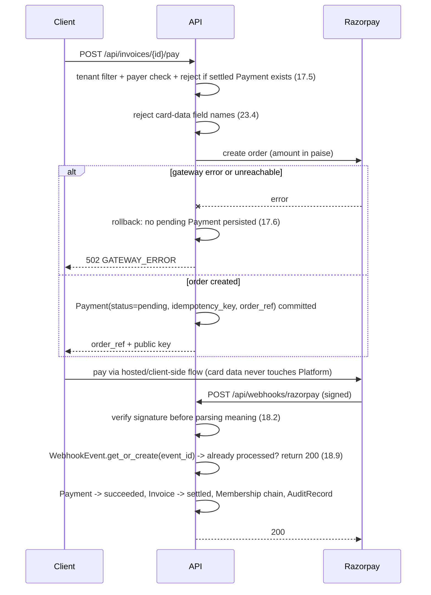
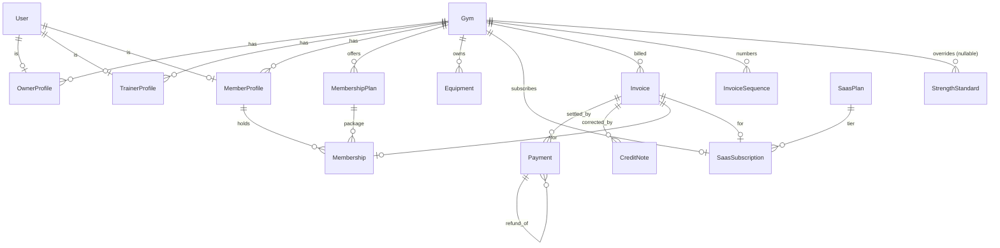

# Design Document

## Overview

Phase 1 turns the existing single-scope Django project (`gymapp` project package, one `core` app,
16 globally-scoped models, no views, no REST framework) into a multi-tenant SaaS product that can
take money. The design keeps the current structure — one Django project package and one `core` app —
and grows it in place. No second app, no parallel package tree.

Four capability areas are delivered:

| Area | Mechanism |
| --- | --- |
| Multi-tenancy | A `Gym` model plus a `gym` FK on every tenant-scoped model, enforced at the API boundary by one shared queryset-filtering mixin |
| Configuration | A `Config_Loader` module (`gymapp/config.py`) that reads and validates every environment-specific value at settings-import time |
| Auth and authorization | Email-primary `User`, JWT via `djangorestframework-simplejwt`, and DRF permission classes that read role and Gym from the database, never from token claims |
| Payments | Razorpay `Gateway_Adapter`, signature-verified idempotent `Webhook_Handler`, `Invoice`/`Payment`/`CreditNote` with GST fields and an append-only `AuditRecord` |

### What changes in the existing codebase

- `core/models.py` — `Plan` splits into `SaasPlan` (Platform-owned) and `MembershipPlan` (Gym-scoped);
  `gym` FKs added; `MemberProfile.status` and `Payment.status` semantics replaced; new models added.
- `gymapp/settings.py` — fully env-driven, `MAILERS` removed, DRF/JWT/logging/security blocks added.
- `core/migrations/0001_initial.py` and `db.sqlite3` — deleted, one clean baseline regenerated.
- `core/views.py` and `core/tests.py` — replaced by `core/views/` and `core/tests/` packages (both files
  are currently empty, so nothing is lost).
- `core/apps.py` — gains `default_auto_field = "django.db.models.BigAutoField"`.
- `requirements.txt` — Django pin corrected to the targeted major version; DRF, simplejwt, razorpay,
  django-environ, psycopg, hypothesis added.

### Design decisions

**D1 — Tenancy by foreign key, not by schema or database.** One deployment, one database, a `gym` FK on
tenant-scoped rows. Schema-per-tenant would multiply migration and connection cost for no Phase 1
benefit. The isolation guarantee is therefore an application-layer guarantee, which is why criterion 3.8
requires a *single* filtering component and 3.9 requires an automated conformance check: with FK
tenancy, a view that forgets to filter is the whole risk, so the design makes forgetting detectable.

**D2 — Authorization reads the database, not the token.** Access tokens carry `user_id`, `role`, and
`gym_id` as claims (13.2) for client convenience, but `Authorization_Layer` re-reads role and Gym from
the `User` row and its profile on every request (13.8). A revoked role or deactivated Gym then takes
effect immediately rather than at token expiry.

**D3 — Derived state over stored state.** `Membership.status`, `MemberProfile` active state, and Gym
write-eligibility are computed at request time from dates, Invoice settlement, and subscription status
(20.1, 20.4, 20.5). Nothing schedules an "expire memberships" job, so there is no window in which
stored status disagrees with the dates. The trade is a small per-request query cost, paid back by not
needing Celery in Phase 1 (Celery is explicitly out of scope).

**D4 — Two independent money flows, one Invoice model.** SaaS Invoices (Platform → Gym_Owner) and
membership Invoices (Gym → Member) share `Invoice`, `Payment`, and the Razorpay adapter, distinguished
by which of the nullable `saas_subscription` / `membership` FKs is populated and by `payer_user`. One
settlement path means one idempotency implementation to get right.

**D5 — Resolution of Known Tension 1 (MemberProfile updates without an active subscription).**
Requirement 21.5 wins. The rule is: *write access to tenant-scoped endpoints requires the Gym's
SaasSubscription to be `trialing` or `active`; the only writes permitted otherwise are those against the
Gym's own SaaS Invoice view/pay endpoints.* Criterion 5.8's surviving substance is that **seat
evaluation** applies only to operations that increase `Seat_Count` — updates to an existing
`MemberProfile` are never seat-evaluated. Requirement 5.8 should be amended to say exactly that. The
reason for choosing 21.5: an unpaid Gym that can still edit member records has no incentive to pay, and
"read-only until you pay" is the standard SaaS dunning posture.

**D6 — Resolution of Known Tension 2 (staff account role and profile).** A **Platform_Operator staff
account** is a `User` whose `is_staff` or `is_superuser` is true. It has `role = "member"` (the model
default, which satisfies 11.2 because `member` is a valid choice), holds **no** profile and **no** Gym,
and derives all access from the Django admin interface, never from `role`. `role` is meaningless for
staff accounts and is never consulted for them; every tenant-scoped API endpoint returns 403 for a staff
account under 3.6 because it holds no profile. Requirement 11.1's default therefore needs no change and
`createsuperuser` needs no override. A Glossary entry should be added for the term.

## Architecture

### Request pipeline



`RequestContext` is resolved once per request and cached on `request.tenant_context`, so permission
classes, the queryset mixin, and serializers all read the same values and cannot disagree.

### Module layout inside the existing app

```
gymapp/
  config.py            # Config_Loader: env readers + startup validation (R6, R7, R8)
  settings.py          # consumes config.py; no literal secrets
  urls.py              # includes core.urls under /api/
core/
  apps.py              # CoreConfig, default_auto_field
  models.py            # all models (single module, as today)
  managers.py          # UserManager (email-based), SoftDeleteManager
  validators.py        # E.164, slug, IANA timezone, GSTIN, ISO-4217
  scoping.py           # TenantScopedQuerysetMixin, RequestContext, NON_TENANT_VIEWS registry
  permissions.py       # IsOwner / IsTrainer / IsMemberSelf / SubscriptionWriteGate / ActiveMemberGate
  serializers.py       # DRF serializers, gym injected from context
  exceptions.py        # custom exception handler -> single error shape (24.9)
  throttling.py        # env-driven scoped throttles with a 5/min floor (24.7, 24.8)
  urls.py              # only the Phase 1 endpoint set (R24)
  views/
    __init__.py
    auth.py            # register, login, refresh, logout, verify, reset request/confirm
    profiles.py        # me, invite/list trainers and members
    catalogue.py       # SaasPlan list, MembershipPlan list
    billing.py         # invoice list, create order, receipt
    webhooks.py        # Razorpay webhook (CSRF-exempt, signature-authenticated)
  services/
    money.py           # Decimal <-> minor units
    slugs.py           # Gym slug derivation and collision suffixing
    seats.py           # atomic seat evaluation
    memberships.py     # end-date computation, status, renewal chaining
    invoicing.py       # numbering sequence, GST computation, settlement
    gateway.py         # Gateway_Adapter (Razorpay), signature verification
    auth_tokens.py     # verification / reset token issue and consume
    audit.py           # AuditRecord writer
    email.py           # non-blocking send helper (8.6)
  management/commands/
    check_tenant_scoping.py   # 3.9 conformance check
    check_api_surface.py      # 24.6 surface check
  tests/
    factories.py, strategies.py, test_properties_*.py, test_api_*.py, test_config.py
```

### Configuration flow (R6, R7, R8)

`gymapp/config.py` exposes typed readers (`env_str`, `env_bool`, `env_int`, `env_list`, `require`) and a
`validate()` function. `settings.py` calls the readers to build settings, then calls `validate()` as its
final statement. Because Django imports settings before serving anything, a violated check raises
`ImproperlyConfigured` at import time and the process never accepts a request (6.8). Checks:

| Condition | Result |
| --- | --- |
| `SECRET_KEY` absent | error naming `SECRET_KEY` (6.3) |
| `DEBUG` absent | `DEBUG = False` (6.4) |
| `DEBUG` false and `ALLOWED_HOSTS` empty | error naming `ALLOWED_HOSTS` (6.5) |
| `DEBUG` false and an entry is `*` or not a valid hostname/IP | error naming the entry (6.6) |
| `DEBUG` false and `SECRET_KEY` starts with `django-insecure-` | error naming the dev key (6.7) |
| `DEBUG` false and `EMAIL_BACKEND` absent | error naming `EMAIL_BACKEND`, no fallback (8.4) |
| `DEBUG` false, SMTP backend, any of `EMAIL_HOST`/`EMAIL_PORT`/`DEFAULT_FROM_EMAIL` absent | error naming **every** absent variable (8.5) |
| `DEBUG` true and `EMAIL_BACKEND` absent | console backend (8.3) |

`DATABASE_URL` selects SQLite or PostgreSQL (6.12). Production security settings (SSL redirect, secure
cookies, `SECURE_HSTS_SECONDS = 31536000`, `SECURE_PROXY_SSL_HEADER`) are applied under `not DEBUG`
(7.1, 7.2); nosniff and `X_FRAME_OPTIONS = "DENY"` apply unconditionally (7.3). `.env.example` lists every
variable name the loader reads, with placeholders only (6.11).

### Tenant isolation mechanism (R3)

Three cooperating parts:

1. **`RequestContext`** — resolves `user`, `profile`, `gym`, `role`, `subscription_status`,
   `is_active_member` from the database. If no non-soft-deleted profile exists, the request is refused
   with 403 *before* any tenant-scoped queryset is constructed (3.6).
2. **`TenantScopedQuerysetMixin`** — the single filtering component (3.8). `get_queryset()` returns
   `super().get_queryset().filter(gym=ctx.gym)`, or for `StrengthStandard`
   `filter(Q(gym=ctx.gym) | Q(gym__isnull=True))` (2.2). It ignores `is_staff`/`is_superuser` entirely
   (3.1). Because filtering happens in `get_queryset`, detail lookups for another Gym's id raise
   `Http404` naturally — the same 404 body a nonexistent id produces, so existence is not disclosed
   (3.2, 3.3, 3.5).
3. **`check_tenant_scoping` management command** — walks the resolved URLconf, classifies each view as
   tenant-scoped unless its callable is registered in `NON_TENANT_VIEWS` (exactly the nine endpoint
   groups in 3.7), and fails with a non-zero exit code if any tenant-scoped view class does not have
   `TenantScopedQuerysetMixin` in its MRO (3.9). Run in CI as a deployment gate alongside
   `manage.py check --deploy` (7.4) and `check_api_surface` (24.6).

Admin access to another Gym's records is permitted for staff (3.10) but wrapped: the `ModelAdmin` base
class writes an `AuditRecord` naming actor, record id, record Gym, operation, and timestamp whenever the
touched record's Gym differs from... nothing, since staff have no Gym — so the rule is simply that every
admin write on a tenant-scoped model is audited.

### Payment flow



Idempotency has two layers: `WebhookEvent.event_id` unique (gateway retry of the *same* event) and
`Payment.idempotency_key` unique (repeat of the same logical operation). Settlement runs inside
`transaction.atomic()` with `select_for_update()` on the `Payment` row, so concurrent deliveries
serialize and the terminal state is reached once (18.6).

## Components and Interfaces

### Config_Loader — `gymapp/config.py`

```python
def env_str(name: str, default: str | None = None) -> str | None
def env_bool(name: str, default: bool) -> bool
def env_int(name: str, default: int) -> int
def env_list(name: str, default: list[str] | None = None) -> list[str]
def require(name: str) -> str                      # raises ImproperlyConfigured naming `name`
def validate(settings_dict: dict) -> None          # all R6/R7/R8 checks; raises ImproperlyConfigured
def is_valid_host(entry: str) -> bool              # hostname or IP, rejects "*"
```

### Auth_Service — `core/services/auth_tokens.py`, `core/views/auth.py`

```python
def authenticate_identifier(identifier: str, password: str) -> User | None
    # email branch: case-insensitive email match
    # phone branch: E.164 validated first; invalid format -> return None without any DB comparison (10.7)
def issue_tokens(user: User) -> dict            # {"access": str, "refresh": str}
def revoke_refresh(token: str) -> None          # simplejwt blacklist
def revoke_all_refresh(user: User) -> None      # used by password reset (14.5)
def issue_email_token(user: User) -> str        # 72h expiry (14.3)
def issue_reset_token(user: User) -> str        # 60m expiry (14.3)
def consume_token(raw: str, purpose: str) -> User   # raises TokenInvalid on expired/consumed
```

Login returns one generic 401 body for "no such identifier" and "wrong password" (10.6). An internal
error during authentication returns 500 with code `AUTH_UNAVAILABLE`, distinct from the 401 code
`INVALID_CREDENTIALS` (10.8). Access-token expiry returns 401 `TOKEN_EXPIRED`; bad signature returns 401
`TOKEN_INVALID` (13.4). Refresh rotates: `ROTATE_REFRESH_TOKENS = True`,
`BLACKLIST_AFTER_ROTATION = True` (13.5, 13.6).

### Authorization_Layer — `core/permissions.py`

| Class | Rule |
| --- | --- |
| `IsAuthenticatedWithProfile` | 401 unauthenticated; 403 if no non-soft-deleted profile or Gym inactive (3.6, 1.7, 15.5) |
| `RoleAllowed` | declarative per-view `allowed_roles` / `write_roles`; absent declaration means deny (15.6) |
| `MemberSelfScope` | `member` role: read/write only records whose Member is the requester; 404 for another Member's record; 403 for writes to non-Member-scoped records (15.2, 15.8, 15.11) |
| `TrainerScope` | `trainer` role: read Members assigned to them, 404 otherwise; write only MemberProfile create in own Gym and updates to assigned Members; 403 for Payment/Invoice writes (15.3, 15.10) |
| `OwnerScope` | `owner` role: read/write own Gym, minus declared immutability rules (15.4, 19.7) |
| `SubscriptionWriteGate` | non-safe methods require subscription `trialing`/`active`, except own SaaS invoice view/pay (D5, 21.5, 5.7) |
| `ActiveMemberGate` | inactive Member: only safe methods and own-Invoice view/pay (20.8) |

Default deny is implemented by setting `DEFAULT_PERMISSION_CLASSES` to a class that refuses unless the
view declares `allowed_roles`, so a new view without a declaration is closed, not open (15.6).

### Gateway_Adapter — `core/services/gateway.py`

```python
class RazorpayAdapter:
    def create_order(self, invoice: Invoice, idempotency_key: str) -> GatewayOrder
        # raises GatewayError -> 502, nothing persisted (17.6)
        # raises CurrencyMismatch if invoice.currency != account currency (17.8)
    def verify_webhook(self, raw_body: bytes, signature: str | None) -> dict
        # HMAC-SHA256 against RAZORPAY_WEBHOOK_SECRET; raises SignatureInvalid before any parsing (18.2)
    def parse_event(self, payload: dict) -> WebhookEventData
        # (event_id, kind, order_ref, payment_ref, method, amount_minor, currency)
```

`GatewayOrder` and `WebhookEventData` are frozen dataclasses, which lets the whole payment layer be
property-tested against a fake adapter with no network.

### Money — `core/services/money.py`

```python
def to_minor_units(amount: Decimal, currency: str = "INR") -> int   # ROUND_HALF_UP on 2dp
def from_minor_units(minor: int, currency: str = "INR") -> Decimal
```

### Seat evaluation — `core/services/seats.py`

```python
def seat_count(gym: Gym) -> int          # MemberProfile rows, deleted_at IS NULL (5.1)
def create_member_atomically(gym: Gym, **fields) -> MemberProfile
    # with transaction.atomic(): Gym row select_for_update -> subscription check (402, 5.7)
    #   -> seat check (409, 5.2) -> User + MemberProfile creation (12.4)
def assert_plan_change_allowed(gym: Gym, new_plan: SaasPlan) -> None    # 409 (5.5, 5.6)
def restore_member(profile: MemberProfile) -> None                       # 409 (5.10)
```

Locking the `Gym` row serializes seat evaluation for that Gym, giving exactly `min(N, K)` successes for
N concurrent creates against K remaining seats (5.1).

### Memberships — `core/services/memberships.py`

```python
def end_date_for(start: date, duration_days: int) -> date    # start + duration_days - 1 (20.2)
def status_of(m: Membership, today: date) -> str             # upcoming | active | expired (20.1)
def is_member_active(profile: MemberProfile, today: date) -> bool   # 20.5
def next_start_date(profile: MemberProfile, settled_on: date) -> date   # 20.6, 20.7
def create_membership(profile, plan, start) -> Membership     # overlap + duration validation (20.3, 20.11)
```

`today` is always `datetime.now(ZoneInfo(gym.timezone)).date()`, never the server-local date.

### Invoicing — `core/services/invoicing.py`

```python
def next_invoice_number(gym: Gym, fy: str) -> str
    # InvoiceSequence row select_for_update -> next_value++ -> "{slug}/{fy}/{n:05d}" (19.3)
def compute_tax(taxable: Decimal, issuer_gstin: str | None, intra_state: bool) -> TaxBreakdown
    # no GSTIN -> all tax fields None (19.5); GSTIN -> CGST+SGST intra-state, IGST inter-state (19.4)
def issue_invoice(...) -> Invoice           # total = taxable + populated components (19.6)
def settle(invoice: Invoice, payment: Payment) -> None
    # idempotent; sets Payment.paid_at, Invoice.status=settled, chains Membership, writes AuditRecord
def void_via_credit_note(invoice: Invoice, reason: str) -> CreditNote   # 19.8
```

### Financial-year rule

`fy` is the Indian financial year containing the issue date: April 1 to March 31, formatted `2025-26`.
Numbering is gapless within `(gym, fy)` because the sequence row is locked and incremented in the same
transaction that inserts the Invoice; a rolled-back Invoice rolls back the increment too.

### Views and endpoint set (R24)

| Method + path | Tenant-scoped | Roles |
| --- | --- | --- |
| `POST /api/auth/register/owner` | no | anonymous (11.3) |
| `POST /api/auth/login`, `POST /api/auth/refresh`, `POST /api/auth/logout` | no | anonymous / token holder |
| `POST /api/auth/verify-email`, `POST /api/auth/password-reset`, `POST /api/auth/password-reset/confirm` | no | anonymous |
| `GET /api/saas-plans` | no | any authenticated (15.9) |
| `GET /api/me`, `PATCH /api/me` | yes | all roles |
| `POST /api/trainers`, `GET /api/trainers`, `POST /api/members`, `GET /api/members` | yes | owner; `POST /api/members` also trainer (15.10) |
| `GET /api/membership-plans` | yes | all roles |
| `GET /api/invoices`, `GET /api/invoices/{id}` | yes | owner, member (own) |
| `POST /api/invoices/{id}/pay` | yes | owner (SaaS), member (own membership) |
| `GET /api/payments/{id}/receipt` | yes | payer only (19.9) |
| `POST /api/webhooks/razorpay` | no | signature only (18.1, 18.10) |

Nothing for workout tracking, body metrics, form checks, diet plans, attendance, equipment, or
notifications (24.5). `check_api_surface` asserts that no URL pattern name or path segment matches those
categories and fails the deployment if one appears (24.6).

### Error shape (24.9)

```json
{"error": {"code": "SEAT_LIMIT_REACHED", "message": "Seat count 50 has reached the plan limit of 50.", "details": {"field": "member"}}}
```

A DRF `EXCEPTION_HANDLER` maps `ValidationError`, `PermissionDenied`, `NotFound`, `Http409`, `Http402`,
and `GatewayError` into this envelope. `details.field` carries the field name for the many criteria that
require an error to *name* a field.

## Data Models

### Entity relationships



### New models

**Gym** (R1)

| Field | Definition |
| --- | --- |
| `name` | `CharField(max_length=200)` — matches `OwnerProfile.business_name` (1.1) |
| `slug` | `SlugField(max_length=60, unique=True)`, validator `^[a-z0-9-]+$`; uniqueness checked case-insensitively (1.4) |
| `contact_email` | `EmailField()` |
| `contact_phone` | `CharField(max_length=15)`, E.164 validator |
| `timezone` | `CharField(max_length=64)`, validated against `zoneinfo.available_timezones()`, default `Asia/Kolkata` |
| `gstin` | `CharField(max_length=15, null=True, blank=True)`, GSTIN validator |
| `created_at` | `DateTimeField(auto_now_add=True)`, excluded from every serializer (1.1 immutability) |
| `is_active` | `BooleanField(default=True)` |

`Meta.constraints`: `UniqueConstraint(Lower("slug"), name="gym_slug_ci_unique")`. `Gym.name` is the
single source of truth for a Gym's name; `OwnerProfile.business_name` is retained as the legal/business
name and is never rewritten by a Gym rename (1.6, 1.13).

**SaasPlan** (4.1) — `name`, `price` `Decimal(12,2) >= 0`, `currency` default `INR`,
`billing_interval_months` `PositiveSmallIntegerField >= 1`, `max_members_allowed`
`PositiveIntegerField(null=True)` with range 1–100000 when non-null (5.3). Not Gym-scoped.

**SaasSubscription** (21.1) — `gym` (OneToOne), `plan`, `start_date`, `current_period_end`,
`status` ∈ {`trialing`, `active`, `past_due`, `cancelled`}, `gateway_subscription_ref` nullable.

**MembershipPlan** (4.2) — replaces the membership half of `Plan`: `gym`, `name`, `price`
`Decimal(12,2) >= 0`, `currency`, `duration_days` `PositiveIntegerField` with `1 <= duration_days <= 3650`
(4.4, 20.3), `includes_trainer`, `includes_diet`. `max_members_allowed` is **removed** (4.3).
`Meta.constraints`: `UniqueConstraint("gym", Lower("name"))` (2.4).

**Membership** (20.1) — `member` FK, `plan` FK, `start_date`, `end_date` (computed on save, never
client-supplied), `deleted_at`. No stored status. `Meta.constraints`: `CheckConstraint(end_date >=
start_date)`. Overlap is rejected in validation rather than by a DB constraint, because SQLite has no
range exclusion (20.11).

**Invoice** (19.1) — `number`, `payer_user` FK, `gym` FK, `saas_subscription` nullable,
`membership` nullable, `taxable_value` `Decimal(12,2)`, `cgst`/`sgst`/`igst` nullable `Decimal(12,2)`,
`hsn_sac` nullable, `total_amount` `Decimal(12,2)`, `currency`, `status` ∈
{`open`, `settled`, `void`, `refunded`}, `issue_date`, `due_date`, `deleted_at`.
`Meta.constraints`: `UniqueConstraint("gym", "financial_year", "sequence_no")` plus
`UniqueConstraint("gym", "number")`.

**InvoiceSequence** — `gym`, `financial_year`, `next_value`; unique on `(gym, financial_year)`. Exists
solely to make 19.3's gapless-ascending guarantee lockable.

**Payment** (R16) — `invoice` FK, `gym` FK, `amount` `Decimal(12,2)` with `amount >= 0.01` (16.5),
`currency` default `INR` restricted to ISO-4217 (16.8), `status` ∈ {`pending`, `succeeded`, `failed`,
`refunded`, `cancelled`} (16.2), `gateway` `CharField` default `razorpay`, `gateway_payment_ref`
nullable unique-when-present (16.4), `gateway_order_ref`, `idempotency_key` unique (16.3), `method` ∈
{`upi`, `card`, `netbanking`} nullable (17.7), `paid_at` nullable, `created_at`,
`recorded_on` `DateField` explicit and settable — replacing `auto_now_add` (16.7), `refund_of` self-FK
nullable (22.7), `deleted_at`.
`Meta.constraints`: `CheckConstraint(amount >= Decimal("0.01"))`,
`UniqueConstraint("gateway_payment_ref", condition=~Q(gateway_payment_ref=None))`.
A transition to `succeeded` sets `paid_at`; a transition from `succeeded` back to `pending` is refused in
`clean()`/service layer (16.9).

**CreditNote** (19.8) — `invoice` FK, `number`, `amount`, `reason`, `issue_date`.

**WebhookEvent** (18.7, 18.9) — `event_id` unique, `kind`, `raw_payload` JSON with card-data keys
stripped, `received_at`, `processed_at` nullable, `matched_payment` nullable,
`reconciliation_required` boolean.

**AuditRecord** (R22) — `actor_user` nullable, `action`, `model_label`, `object_id`, `gym` nullable,
`changes` JSON `{field: [before, after]}`, `created_at`. No update or delete path: the model's manager
raises on `update()`/`delete()`, admin registers it read-only, and no API endpoint exposes it (22.2).

**EmailVerificationToken / PasswordResetToken** — `user`, `token_hash`, `expires_at`, `consumed_at`.
Only hashes are stored. Expiries 72h and 60m (14.3).

### Changes to existing models

| Model | Change |
| --- | --- |
| `User` | `USERNAME_FIELD = "email"`, `email` unique and non-empty (10.1, 10.2), `username` dropped from the login path and optional on registration (10.9), `phone` `null=True, unique=True` with E.164 validator (10.3), `role` gains `default="member"` (11.1), new `email_verified` boolean, custom `UserManager` with `create_user`/`create_superuser` keyed on email |
| `OwnerProfile`, `TrainerProfile`, `MemberProfile` | non-nullable `gym` FK (1.3, 2.1), `deleted_at` for soft delete |
| `MemberProfile` | `plan` FK retargeted to `MembershipPlan`; `status` field **removed** in favour of derived active state (20.4); `join_date` becomes an explicit settable `DateField` (20.9) |
| `Plan` | renamed to `MembershipPlan`, `max_members_allowed` removed (4.3) |
| `Equipment` | non-nullable `gym` FK (2.1) |
| `StrengthStandard` | nullable `gym` FK; `unique_together` becomes `("gym", "exercise_name", "gender")` (2.2, 2.5) |
| `Payment` | replaced as described above |
| `Attendance`, `DietPlan`, `WorkoutSplit`, `Exercise`, `WorkoutLog`, `BodyMetric`, `FormCheck`, `Notification` | unchanged; reachable only through `MemberProfile`, and exposed by no Phase 1 endpoint (24.5) |

### Cross-Gym reference validation (2.6, 2.7)

`MemberProfileSerializer.validate()` checks `trainer.gym_id == ctx.gym.id` and
`plan.gym_id == ctx.gym.id`, raising a field-named `ValidationError`. The `gym` value itself always comes
from `ctx.gym`; a `gym` key in the request body is popped and ignored (2.3, 11.6, 15.7).

### Migration baseline (R9)

One migration, `core/migrations/0001_initial.py`, regenerated after `db.sqlite3` and the current
`0001_initial.py` are deleted. Deletion and regeneration are scripted as a single step so a failed
deletion produces no migration (9.2). All `gym` FKs are declared non-nullable with no backfill (9.3);
the `User` model is declared with email as identifier (9.4). CI asserts `migrate` on an empty database
succeeds (9.5) and `makemigrations --check --dry-run` reports nothing pending (9.6).

## Correctness Properties

*A property is a characteristic or behavior that should hold true across all valid executions of a
system — essentially, a formal statement about what the system should do. Properties serve as the bridge
between human-readable specifications and machine-verifiable correctness guarantees.*

PBT applies to most of this feature: slug derivation, money conversion, date
arithmetic, tax arithmetic, seat accounting, tenant filtering, authorization decisions, and webhook
idempotency all vary meaningfully with input and are cheap to run 100+ times against SQLite with a fake
gateway. Configuration and security-header criteria (R6, R7, most of R9 and R24's route presence) do not
vary with input and are verified by single-execution checks instead — they appear in the Testing Strategy,
not here.

The 40 properties below came out of the prework analysis after consolidation — roughly 120 criteria
classified as PROPERTY were merged where one property implied another (per-role authorization instances
folded into role monotonicity, N=1 webhook cases folded into idempotency, complementary accept/reject
pairs folded into single biconditional properties). Each remaining property has a distinct failure mode.

**Tenancy**

### Property 1: Tenant isolation

*For any* set of at least two Gyms with randomly distributed tenant-scoped records, and any authenticated
request from a User of Gym A to any tenant-scoped endpoint, every record identifier appearing anywhere in
the response — top level, nested, or contributing to an aggregate count — belongs to Gym A or is a
StrengthStandard whose Gym is null, and this holds regardless of the requesting User's `is_staff` and
`is_superuser` values.

**Validates: Requirements 3.1, 3.4, 2.2, 15.9**

### Property 2: Cross-Gym record existence is not disclosed

*For any* tenant-scoped record type and any request method, a request from a User of Gym A naming a record
of Gym B produces the same HTTP status code and the same response body structure as the same request
naming an identifier that matches no record on the Platform, and leaves every stored record unchanged.

**Validates: Requirements 3.5, 3.2, 3.3**

### Property 3: Access gates deny before any data is read

*For any* tenant-scoped endpoint and any gate condition — unauthenticated requester, requester holding no
non-soft-deleted profile, or requester whose Gym has `is_active` false — the API responds with 401 for the
unauthenticated case and 403 for the others, issues no query against any tenant-scoped model, and leaves
every stored record unchanged.

**Validates: Requirements 3.6, 1.7, 15.5, 15.1**

### Property 4: Tenant assignment ignores client input

*For any* create request against a tenant-scoped model, and *for any* Gym identifier injected into the
request body, the stored record's Gym equals the authenticated User's Gym.

**Validates: Requirements 2.3**

### Property 5: Cross-Gym references are rejected by field

*For any* two distinct Gyms A and B, and *for any* reference field in {trainer, plan} on a MemberProfile of
Gym A, assigning a Gym B object to that field is rejected with a validation error naming that field, and
no MemberProfile row changes.

**Validates: Requirements 2.6, 2.7**

### Property 6: Uniqueness is scoped per Gym

*For any* key value, creating two records with that key in the same Gym is rejected while creating one
record with that key in each of two different Gyms succeeds, for MembershipPlan keyed on name and for
StrengthStandard keyed on (exercise_name, gender).

**Validates: Requirements 2.4, 2.5**

### Property 7: Slug derivation is well-formed and collision-free

*For any* Unicode business name string, the derived Gym slug matches `^[a-z0-9]+(-[a-z0-9]+)*$`, is at most
60 characters, equals `gym` as its derivation base when the transliterated name is empty, and *for any*
number k of pre-existing colliding slugs with 1 <= k <= 49, the derived slug is unique across Gyms
compared case-insensitively and still at most 60 characters.

**Validates: Requirements 1.9, 1.10, 1.11, 1.4**

### Property 8: Registration is all-or-nothing

*For any* owner registration payload, either exactly one Gym, one User, and one linked OwnerProfile exist
after the request, or none of the three exist — including when a failure is injected at any step of the
transaction — and the Gym's name, not `OwnerProfile.business_name`, is the value returned wherever a Gym
name appears, with `business_name` unchanged by any later Gym rename.

**Validates: Requirements 1.2, 1.8, 1.6, 1.13, 1.12**

**Identity and authorization**

### Property 9: Login succeeds for either identifier

*For any* User with a password and *for any* identifier kind in {email, phone}, presenting that identifier
with the correct password authenticates exactly that User and yields both a signed access token and a
signed refresh token.

**Validates: Requirements 10.4, 10.5, 13.1**

### Property 10: Credential failures are indistinguishable

*For any* identifier that matches no User and *for any* User presented with a wrong password, the response
is HTTP 401 with byte-identical code and message across both cases, and *for any* identifier that is not
valid E.164 and not an email, the rejection occurs with no query filtering on stored phone values.

**Validates: Requirements 10.6, 10.7**

### Property 11: Identifier validation and uniqueness

*For any* string, it is accepted as a User email only if non-empty after trimming and unique across the
Platform compared case-insensitively, and accepted as a User phone only if it matches
`^\+[1-9]\d{7,14}$` and is unique among non-null phone values; rejection names the offending field, and
any number of Users may hold a null phone.

**Validates: Requirements 10.1, 10.2, 10.3, 10.9, 10.10**

### Property 12: Access token claims round-trip

*For any* User identifier, role, and Gym identifier, decoding the access token issued for those values
yields exactly those three values.

**Validates: Requirements 13.7, 13.2**

### Property 13: Token lifecycle — rotation, revocation, single use, expiry

*For any* User and *for any* clock offset, a refresh token can be exchanged exactly once before being
invalidated, a logged-out refresh token is refused with 401, a password reset revokes every outstanding
refresh token of that User, and a verification or reset token is accepted if and only if it has not been
consumed and the offset since issue is within 72 hours for verification and 60 minutes for reset.

**Validates: Requirements 13.5, 13.6, 14.1, 14.2, 14.3, 14.5, 14.6**

### Property 14: Effective permissions never exceed the stored role

*For any* User, endpoint, HTTP method, and request body — including bodies that name another role, another
Gym, another User, or forged token claims that disagree with the database — the set of records the request
reads or modifies is a subset of the set permitted by the role and Gym stored on that User's database row.

**Validates: Requirements 15.7, 11.6, 15.2, 15.4, 15.8, 15.11, 13.8, 3.1**

### Property 15: Trainer scope follows the assignment graph

*For any* Gym containing a random trainer-to-member assignment graph, a Trainer's read of a Member's record
succeeds if and only if that Member is assigned to that Trainer, returning 404 otherwise, and the
Trainer's writes are limited to creating a MemberProfile in that Gym and updating assigned Members, with
every other write — including any write to Payment or Invoice — denied with 403.

**Validates: Requirements 15.3, 15.10**

### Property 16: Role and profile always agree

*For any* sequence of registration, invitation, role-change, profile-creation, and failure-injection
operations, every committed User whose `is_staff` and `is_superuser` are both false holds exactly one
non-soft-deleted profile whose type corresponds to the stored role, and every operation that would violate
that correspondence — mismatched profile type, second profile, role change with an existing profile of the
previous type, or any profile for a staff account — is rejected with a validation error naming the
conflicting values while leaving the existing role and profile unchanged.

**Validates: Requirements 12.4, 12.1, 12.2, 12.3, 12.5, 12.6, 12.7, 11.1, 11.3, 11.4, 11.5**

### Property 17: Uniform error envelope

*For any* request that produces a non-2xx response, the response body matches the documented error
envelope with a non-empty machine-readable code and a non-empty human-readable message, and *for any*
model field declaring a restricted choice set, a value outside that set is rejected.

**Validates: Requirements 24.9, 11.1, 16.2, 19.2, 21.2**

**Money**

### Property 18: Minor-unit conversion round-trips

*For any* Decimal amount with exactly two decimal places, converting the amount to the Payment_Gateway's
minor-unit integer representation and back yields the original amount.

**Validates: Requirements 17.4, 17.3**

### Property 19: Invoice total equals taxable value plus populated tax

*For any* taxable value and *for any* GST configuration — no GSTIN, intra-state GSTIN, or inter-state
GSTIN — the Invoice total equals the taxable value plus the sum of the populated CGST, SGST, and IGST
amounts, the unpopulated tax fields are null, and the GSTIN and HSN or SAC code are present exactly when
a GSTIN is recorded.

**Validates: Requirements 19.6, 19.4, 19.5**

### Property 20: Invoice numbers are unique and gapless per Gym and financial year

*For any* sequence of Invoice issue attempts across random Gyms and financial years, including concurrent
attempts and attempts whose transaction rolls back, the numbers committed within each (Gym, financial
year) pair form a contiguous ascending sequence starting at 1 with no gaps and no duplicates.

**Validates: Requirements 19.3**

### Property 21: Payment amount and currency validation

*For any* Decimal value, it is accepted as a Payment amount if and only if it is greater than or equal to
0.01 and representable in 12 digits with 2 decimal places, rejection names the amount field, and *for any*
three-letter string it is accepted as a currency if and only if it is a valid ISO 4217 code, with `INR`
applied as the default.

**Validates: Requirements 16.5, 16.6, 16.8**

### Property 22: Order creation is safe and complete

*For any* open Invoice, requesting payment creates exactly one Payment with status `pending`, a unique
Idempotency_Key, and the gateway order reference, and returns the order reference and the public gateway
key; *for any* gateway failure mode, the response is 502 and no Payment row remains for that attempt;
*for any* Invoice already holding a `succeeded` Payment the request is refused with 409; and *for any*
currency differing from the gateway account currency the request is refused.

**Validates: Requirements 17.1, 17.2, 17.5, 17.6, 17.8, 16.3, 16.4**

### Property 23: Webhook processing is idempotent

*For any* verified gateway event and *for any* delivery count N >= 1, including concurrent deliveries,
processing that event N times produces exactly one Payment record in a terminal status, the same Invoice
settlement state as processing it once, and the same Membership chain as processing it once; and *for any*
event referencing an order that matches no Payment, the response is 200, the event is recorded for
reconciliation, and no Payment is created.

**Validates: Requirements 18.6, 18.4, 18.5, 18.7, 18.9, 17.7**

### Property 24: Unverified webhooks change nothing

*For any* request body and *for any* signature that is absent, computed with a wrong secret, or computed
over different bytes, the Webhook_Handler responds 400 with the signature error rather than a parse error,
and every Payment, Invoice, and Membership row is unchanged.

**Validates: Requirements 18.2, 18.3**

### Property 25: Settled financial records are immutable and the ledger balances

*For any* sequence of invoice issue, order creation, webhook settlement, refund, and soft-delete
operations, the sum of each Member's `succeeded` Payment amounts equals the sum of that Member's `settled`
Invoice totals net of refunds; every stored Payment amount is greater than 0; every attempt to change the
amount, taxable value, or tax fields of a `settled` Invoice is refused with 409 leaving the row unchanged,
with corrections appearing as CreditNote rows; every refund is a new Payment with status `refunded`
referencing the original, leaving the original unchanged apart from its status; and every create or modify
of a Payment, Invoice, or Membership has a matching append-only AuditRecord naming actor, timestamp,
record identifier, and before/after values for exactly the changed fields.

**Validates: Requirements 22.5, 22.6, 22.7, 22.1, 22.2, 22.3, 22.4, 19.7, 19.8, 16.9, 16.7, 19.9, 3.10**

### Property 26: No credential or secret value ever leaves the Platform

*For any* payment-endpoint request body containing a card-data field name at any nesting depth, the request
is refused with 400 and the field value appears in no log record; and *for any* payment interaction, the
Payment_Gateway secret key and webhook secret appear in no response body and no log record.

**Validates: Requirements 23.4, 23.2, 23.5**

**Membership and subscription lifecycle**

### Property 27: Membership end date arithmetic

*For any* start date and *for any* `duration_days` between 1 and 3650, the computed end date satisfies
`end_date - start_date == duration_days - 1` and `end_date >= start_date`, and *for any* `duration_days`
outside that range the Membership is rejected with a validation error naming the plan field and no
Membership row is created.

**Validates: Requirements 20.2, 20.3, 4.4**

### Property 28: Membership status classification

*For any* Membership period, any Gym IANA timezone, and any instant, the derived status is `upcoming`
before the start date, `active` from the start date through the end date inclusive, and `expired` after
the end date, evaluated against the current date in the Gym's timezone.

**Validates: Requirements 20.1**

### Property 29: A Member is active exactly when paid and in period

*For any* combination of Membership dates, MembershipPlan price, and Invoice status, the Member's computed
active state is true if and only if the Member holds a Membership whose status is `active` that either
references a `settled` Invoice or references a zero-price plan with no Invoice; the profile endpoint
returns that state together with the latest Membership end date, or null when the Member holds no
Membership; and no request can set an active or status field on MemberProfile while `join_date` accepts any
supplied date.

**Validates: Requirements 20.5, 20.4, 20.9, 20.10**

### Property 30: Memberships never overlap and renewals chain

*For any* Member and *for any* sequence of assignments and renewal settlements, no two of that Member's
Memberships have intersecting date periods, an attempt to create an overlapping Membership is rejected
with a validation error naming the start date field, a renewal settled while the Member holds a Membership
ending on or after today starts the day after the latest such end date, a renewal settled with no such
Membership starts on the settlement date in the Gym's timezone, and a plan switch during an active
Membership leaves that Membership's dates and Invoice unchanged with no proration applied.

**Validates: Requirements 20.11, 20.6, 20.7, 20.12, 4.6, 4.7**

### Property 31: Seat count never exceeds the plan limit

*For any* sequence of MemberProfile create, soft-delete, restore, and SaasPlan-change operations against a
Gym, the Gym's Seat_Count is less than or equal to the non-null `max_members_allowed` of that Gym's
current SaasPlan after every operation, and is unbounded when that value is null.

**Validates: Requirements 5.4, 5.3**

### Property 32: Concurrent member creation respects remaining seats

*For any* member count N >= 1 and *for any* remaining seat count K >= 0, issuing N concurrent MemberProfile
creation requests against a Gym with K remaining seats results in exactly min(N, K) created records, with
the remainder refused, and no intermediate state exceeding the limit.

**Validates: Requirements 5.1**

### Property 33: Seat and subscription gates apply only to Seat_Count increases

*For any* Gym, creation of a MemberProfile is refused with 409 naming the current Seat_Count and the limit
when Seat_Count has reached a non-null limit, refused with 402 when the Gym has no SaasSubscription in
status `trialing` or `active`, and a restore that would exceed the limit is refused with 409 leaving the
record soft-deleted; while *for any* update to an existing MemberProfile and *for any* Invoice settlement
or Membership date change, no seat evaluation occurs and Seat_Count is unchanged.

**Validates: Requirements 5.2, 5.7, 5.10, 5.8, 5.9**

### Property 34: Plan changes respect the current seat count

*For any* current Seat_Count and *for any* requested SaasPlan, the change is accepted if and only if the
requested plan's `max_members_allowed` is null or greater than or equal to that Seat_Count; a refusal is
409 naming both numbers and leaves the SaasSubscription unchanged.

**Validates: Requirements 5.5, 5.6**

### Property 35: Subscription state gates writes but never reads

*For any* SaasSubscription status and *for any* (endpoint, method) pair, requests from that Gym's Users
succeed for safe methods and are refused with 403 for unsafe methods when the status is `past_due` or
`cancelled`, except for that Gym's own SaaS Invoice view and pay endpoints; and *for any* inactive Member,
requests are permitted only for safe methods the Member is otherwise authorized to make and for viewing
and paying that Member's own Invoices.

**Validates: Requirements 21.5, 20.8**

### Property 36: Subscription period arithmetic

*For any* configured trial length, a newly created Gym has a SaasSubscription in status `trialing` whose
period end is the creation date plus that length; *for any* billing interval and prior period end,
settling a SaaS Invoice sets the status to `active` and advances the stored period end by that interval;
*for any* instant after a period end with no settled next-period Invoice, the status becomes `past_due`;
and *for any* configured lead time, a SaaS Invoice exists exactly when the current date has reached the
period end minus that lead time.

**Validates: Requirements 21.3, 21.4, 21.6, 21.7**

### Property 37: Rate limit clamping and enforcement

*For any* configured per-minute request rate, the effective rate equals the maximum of the configured
value and 5, and *for any* request count exceeding the effective rate against the login, registration, or
password-reset endpoints, the excess requests are refused with 429.

**Validates: Requirements 24.8, 24.7**

### Property 38: Phase 1 API surface excludes deferred categories

*For any* pattern in the resolved URLconf, the pattern does not route to a view over WorkoutSplit,
Exercise, WorkoutLog, BodyMetric, FormCheck, DietPlan, Attendance, Equipment, or Notification, and every
pattern classified as tenant-scoped has the shared tenant-filtering component in its view's MRO.

**Validates: Requirements 24.5, 3.7, 3.8**

### Property 39: Optional email failures do not fail the operation

*For any* operation that sends email not required to complete it, when the mail backend raises a transport
error the API response remains successful, the originating record is persisted, and a log record contains
the recipient address and the message type; and *for any* password submitted at registration, reset, or
change, the configured validators are applied.

**Validates: Requirements 8.6, 14.8, 14.1**

### Property 40: Missing SMTP configuration is reported completely

*For any* subset of `EMAIL_HOST`, `EMAIL_PORT`, and `DEFAULT_FROM_EMAIL` absent from the environment while
`DEBUG` is false and the SMTP backend is selected, startup fails with an error naming exactly the absent
variables; and *for any* list of `ALLOWED_HOSTS` entries while `DEBUG` is false, startup succeeds if and
only if every entry is a valid hostname or IP address and none is `*`, with the error naming the offending
entry.

**Validates: Requirements 8.5, 6.6, 6.7**

## Error Handling

### Response envelope

Every error passes through `core/exceptions.py:api_exception_handler`, registered as DRF's
`EXCEPTION_HANDLER`, and emerges as:

```json
{"error": {"code": "<MACHINE_CODE>", "message": "<human message>", "details": {"field": "<name>"}}}
```

`details` is present only when a criterion requires the error to name a field or to state numbers
(seat counts, limits). This satisfies 24.9 uniformly, including for errors raised inside services rather
than serializers.

### Code catalogue

| Code | Status | Raised when |
| --- | --- | --- |
| `INVALID_CREDENTIALS` | 401 | Unknown identifier or wrong password — one message for both (10.6) |
| `TOKEN_EXPIRED` / `TOKEN_INVALID` | 401 | Access token expired vs. bad signature (13.4) |
| `TOKEN_CONSUMED` | 400 | Verification/reset token expired or already used (14.6) |
| `AUTH_UNAVAILABLE` | 500 | Auth_Service internal failure (10.8) |
| `NOT_AUTHENTICATED` | 401 | Anonymous request to a tenant-scoped endpoint (15.5) |
| `FORBIDDEN` | 403 | Role, profile, Gym-inactive, subscription, or inactive-member gate (1.7, 3.6, 15.6, 20.8, 21.5) |
| `NOT_FOUND` | 404 | Nonexistent id **and** other-Gym or other-Member id — identical body (3.2, 3.5, 15.8) |
| `VALIDATION_ERROR` | 400 | Field validation, with `details.field` (1.4, 2.6, 2.7, 10.10, 12.2, 20.3, 20.11) |
| `SEAT_LIMIT_REACHED` | 409 | Seat evaluation refusal, message states count and limit (5.2, 5.10) |
| `PLAN_DOWNGRADE_BLOCKED` | 409 | Requested limit below Seat_Count (5.5) |
| `SUBSCRIPTION_REQUIRED` | 402 | No `trialing`/`active` subscription on member creation (5.7) |
| `INVOICE_ALREADY_PAID` | 409 | Order requested for an Invoice with a succeeded Payment (17.5) |
| `INVOICE_IMMUTABLE` | 409 | Financial-field change on a settled Invoice (19.7) |
| `CURRENCY_MISMATCH` | 400 | Invoice currency differs from gateway account currency (17.8) |
| `GATEWAY_ERROR` | 502 | Gateway error or unreachable during order creation (17.6) |
| `CARD_DATA_REJECTED` | 400 | Card-data field name in a payment body (23.4) |
| `SIGNATURE_INVALID` | 400 | Webhook signature absent or not verifying (18.3) |
| `RATE_LIMITED` | 429 | Throttle exceeded (24.7) |

### Failure-handling policies

- **Startup failures** — `ImproperlyConfigured` at settings import. Fail-fast, never degrade
  (6.3, 6.5, 6.6, 6.7, 6.8, 8.4, 8.5).
- **Gateway failures during order creation** — the Payment insert and the gateway call sit in one
  `transaction.atomic()` block with the gateway call last; an exception rolls the pending Payment back, so
  no orphan `pending` row survives (17.6).
- **Webhook failures** — signature failure returns 400 before parsing. An unmatched order reference
  returns 200 with `reconciliation_required = True`, because returning an error would make Razorpay retry
  an event the Platform can never match (18.7). Processing errors after a verified signature return 500 so
  Razorpay retries, and the `WebhookEvent.processed_at` guard makes the retry safe (18.6).
- **Optional email failures** — caught in `services/email.py`, logged at `ERROR` on the `core.auth`
  logger with recipient and message type, and swallowed so the originating request still succeeds (8.6).
- **Existence disclosure** — 404 is returned for other-Gym and other-Member records with the same body a
  nonexistent id produces; password-reset requests always return 202 (3.5, 14.4, 15.8).
- **Concurrency conflicts** — seat evaluation and invoice numbering use `select_for_update()`; a loser in a
  race receives the ordinary business error (409 seat limit), not a database error.
- **Logging discipline** — no payment-endpoint request body is ever logged; the payments logger emits only
  order reference, payment reference, amount, currency, and status (23.2). Secrets are read from env and
  never logged or serialized (23.5).

## Testing Strategy

### Tooling

| Concern | Choice |
| --- | --- |
| Test runner | `pytest` + `pytest-django` (`pytest-xdist` optional for the concurrency properties) |
| Property-based testing | `hypothesis` with `hypothesis[django]` for model strategies — not hand-rolled |
| API client | DRF `APIClient` |
| Gateway | `FakeRazorpayAdapter` implementing the `RazorpayAdapter` interface, injected by setting override; no network in unit or property tests |
| Clock | `freezegun` for the date/expiry boundary properties |
| Concurrency | `ThreadPoolExecutor` against a PostgreSQL test database for the seat and idempotency race properties (SQLite's locking is too coarse to prove 5.1) |

### Property test rules

- Every property in this document is implemented by exactly one property-based test.
- Each test runs at least 100 examples: `@settings(max_examples=100)`, raised to 500 for the pure
  functions (Properties 7, 18, 19, 27, 28).
- Each test carries a tag comment naming the feature and property:

  ```python
  # Feature: gym-saas-core, Property 18: For any Decimal amount with exactly two decimal places,
  # converting the amount to the Payment_Gateway's minor-unit integer representation and back
  # yields the original amount.
  @settings(max_examples=500)
  @given(amount=two_dp_decimals())
  def test_minor_unit_round_trip(amount):
      assert from_minor_units(to_minor_units(amount)) == amount
  ```

- Stateful properties (16, 25, 30, 31) use `hypothesis.stateful.RuleBasedStateMachine`, checking the
  invariant after every rule via `@invariant()`.
- Shared strategies live in `core/tests/strategies.py`: `gyms()`, `users(role=...)`,
  `two_dp_decimals()`, `e164_phones()`, `unicode_business_names()`, `iana_timezones()`,
  `membership_periods()`, `gateway_events()`, `tenant_scoped_endpoints()`.
- Generators deliberately include the edge cases the prework classified as EDGE_CASE: empty and
  whitespace strings, names that transliterate to empty, 50-deep slug collisions, leap-year and
  DST-adjacent dates, `duration_days` at 0/1/3650/3651, amounts at 0.00/0.01, expiry offsets straddling
  the 72h and 60m boundaries, and `django-insecure-` prefixed keys.

### Unit tests (examples, kept deliberately few)

Model shape and schema assertions (1.1, 1.3, 2.1, 4.1, 4.2, 4.3, 16.1, 19.1, 21.1), single-condition
config defaults (6.3, 6.4, 6.5, 8.3, 8.4), `createsuperuser` role (11.2), distinct expiry vs. signature
codes (13.4), endpoint-shape contrast for reset request vs. confirm (14.7), default-deny for a
declaration-less view (15.6), webhook latency budget (18.8), migration-script atomicity (9.2), and the
two conformance-checker tests that deliberately register a non-conforming view (3.9, 24.6).

### Single-execution checks (deployment gates)

Run in CI in this order; any failure fails the deployment:

1. `manage.py check --deploy` against the production configuration — zero WARNING or above (7.4).
2. `manage.py check_tenant_scoping` — every tenant-scoped view carries the shared filtering mixin (3.9).
3. `manage.py check_api_surface` — no deferred-category route registered (24.6).
4. `manage.py makemigrations --check --dry-run` — nothing pending (9.6); `migrate` on an empty database
   succeeds (9.5).
5. Configuration and hardening assertions: settings presence and values (6.1, 6.9, 6.10, 6.12, 7.1, 7.2,
   7.3, 7.5, 13.3, 24.1), `MAILERS` absent (8.1), no `SECRET_KEY` literal in tracked source (6.2),
   `.env.example` covers every variable the loader reads (6.11), Django pin matches the target major
   version (6.13), one migration file present with non-nullable Gym FKs and email identity (9.1, 9.3,
   9.4), no card-data field name on any model (23.1) or in any serializer (23.3), route presence for the
   Phase 1 endpoint set (24.2, 24.3, 24.4), and webhook CSRF exemption with no auth class (18.1, 18.10).

### Integration tests (Razorpay sandbox, few and slow)

Marked `@pytest.mark.integration` and excluded from the default run:

1. Create a real order for a small INR amount and assert the order reference shape.
2. Replay a captured real webhook payload with a real signature and assert settlement.
3. Assert a sandbox failure event drives the Payment to `failed` with the Invoice still open.

These verify wiring against the actual gateway; the logic they cover is already property-tested against
the fake adapter, so 1–3 examples are enough.

### Coverage of the requirement set

203 acceptance criteria: 40 properties cover the input-varying behaviour, roughly 20 example-based unit
tests cover single-condition and schema criteria, about 40 single-execution checks cover configuration,
hardening, migration, and surface criteria, and 3 integration tests cover gateway wiring. Criteria that
are organisational rather than behavioural (3.8's "one shared component", 12.1's product decision) are
verified structurally by the conformance commands rather than by behavioural tests.
